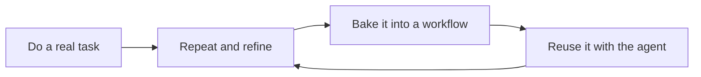

<div align="center">

# Agentic Workflows

**Workflows I built with my agent, refined through repetition, and baked into reusable skills.**

[](LICENSE)
[](docs/harnesses.md)
[](docs/harnesses.md)
[](#packages)

[Explore the workflows](#cool-things-you-can-do) · [Install](#install) · [Onboarding](plugins/agentic-workflows/skills/agentic-workflows/references/onboarding.md) · [Contribute](#development)

</div>

## The story

I work with my agent on software, research, business operations, creative projects, and everyday tasks. After doing the same kind of work several times, a useful process starts to emerge: how to begin, which tools to use, what to check, and where I need to make a decision.

This repository is where I bake those processes into reusable workflows. The next time a similar task comes up, the agent has a starting point that carries the lessons from earlier sessions.

Each workflow captures more than the opening prompt. It can include instructions, references, templates, helper scripts, and checks for the finished result. The collection keeps growing as I use it and find better ways to work.



## Cool things you can do

| Start with a task | What the workflow brings | Explore |
| --- | --- | --- |
| **Ship a software change** | Request intake, diagnosis, isolated worktrees, local checks, and a reviewable PR. Codex delivery orchestration can coordinate implementation, review, verification, and a declared deployment target when explicitly invoked. | [Development workflow](plugins/agentic-workflows/skills/standard-development-workflow/SKILL.md) · [Orchestration](plugins/agent-orchestration/README.md) |
| **Turn past sessions into better workflows** | Review recurring corrections and rework, identify useful improvements, and check live issues and PRs before proposing duplicate work. | [Session reflection](plugins/agentic-workflows/skills/session-reflection/SKILL.md) |
| **Design a purposeful frontend** | Start with minimal views, reveal detail through interaction, and tailor student, instructor, and manager apps to their tasks. Keep accepted taste in project context. | [UI Design](plugins/ui-design/README.md) |
| **Build a Chrome extension** | Manifest V3 architecture, modern web APIs and AI fallbacks, optional Chrome DevTools testing, and permission/privacy records for store preparation. | [Chrome Extensions](plugins/chrome-extensions/README.md) |
| **Research with papers you can actually inspect** | Find and verify scholarly sources, keep local PDF evidence and research notes, build synthesis matrices, or manage a systematic review's records and reporting. | [Verified research](plugins/agentic-workflows/skills/verified-literature-research/SKILL.md) · [Systematic reviews](plugins/systematic-literature-review/README.md) |
| **Write with an agent beside you** | Plan an academic report, improve prose while preserving meaning, or work paragraph by paragraph with a coach that compiles your own wording. | [Academic writing](plugins/agentic-workflows/skills/academic-writing-workflow/SKILL.md) · [Humanizer](plugins/agentic-workflows/skills/humanizer/SKILL.md) · [Guided writing](plugins/guided-writing/README.md) |
| **Run business and cloud operations** | Route ERPNext work across finance, sales, stock, manufacturing, people, and reporting; inspect and operate authorized Railway, Vercel, Cloudflare, and DigitalOcean accounts. | [ERPNext](plugins/erpnext-operations/README.md) · [Railway](plugins/railway-account/README.md) · [Vercel](plugins/vercel-account/README.md) · [Cloudflare](plugins/agentic-workflows/skills/cloudflare-account-operations/SKILL.md) · [DigitalOcean](plugins/agentic-workflows/skills/digitalocean-account-operations/SKILL.md) |
| **Take a trend through to a product concept** | Keep source-backed audience and trend evidence, test merchandise hypotheses, prepare design briefs, and build launch and measurement packets. | [Trend to Product](plugins/trend-to-product/README.md) |
| **Make visual assets with checks built in** | Preview and revise Excalidraw scenes, generate styled QR codes verified by a real decoder, or refine food photos with explicit visual review. | [Excalidraw](plugins/excalidraw/README.md) · [QR codes](plugins/qr-code-generator/README.md) · [Food images](plugins/image-editing/README.md) |
| **Build a media library you can resume** | Inspect YouTube metadata, retrieve authorized media and subtitles, and incrementally sync bounded playlists and channels. Browse Reddit through a connected browser session. | [YouTube](plugins/youtube/README.md) · [Reddit](plugins/reddit/README.md) |
| **Bring the agent into everyday work** | Plan restaurant campaigns with offer economics and expiry, or estimate meal nutrition with uncertainty. | [Restaurant marketing](plugins/restaurant-marketing/README.md) · [Calorie tracker](plugins/calorie-tracker/README.md) |

## What makes these workflows useful

- **They remember the process.** Prerequisites, decision points, recovery steps, and finish criteria live alongside the skill.
- **They check the result.** Depending on the task, that means tests, source evidence, a decoded QR payload, a rendered scene, or a provider readback.
- **They keep decisions explicit.** Drafting, publishing, merging, deploying, and spending have distinct boundaries in the workflows that need them.
- **They improve through use.** Session reflection helps turn recurring friction into a concrete workflow improvement.
- **They travel across tasks.** The same catalog supplies Codex packages and generated Claude Code packages, with support declared per skill.

Railway, Vercel, Cloudflare, DigitalOcean, ERPNext, and Excalidraw default to
authenticated CLI/client operations. If CLI authentication is missing, use the
built-in Codex browser for supported login or secure API-key/token acquisition,
then verify CLI identity and the exact project target. Browser service operations
are fallback only when the authenticated client cannot perform the requested action.

A skill supplies the working method. Your host supplies the model and tools, and provider workflows use your own configured accounts. Read the selected skill's **Prerequisites** before starting; some workflows depend on Codex-specific capabilities.

## Install

Start with the central `agentic-workflows` package. It includes the router and a broad collection of skills. Add focused packages when you want a smaller selection.

### Codex

```sh
codex plugin marketplace add wilsonle/agentic-workflows
codex plugin add agentic-workflows@agentic-workflows
```

### Claude Code

```sh
claude plugin marketplace add wilsonle/agentic-workflows
claude plugin install agentic-workflows@agentic-workflows
```

Start a new task or session after installation. Review and trust the central Codex package's hooks before using its repository-workflow routing and background session-title features. See the [onboarding guide](plugins/agentic-workflows/skills/agentic-workflows/references/onboarding.md) for first-use checks and the [harness guide](docs/harnesses.md) for exact support boundaries.

For a focused package, replace `<package>` with a name from [the catalog below](#packages):

```sh
# Codex
codex plugin add <package>@agentic-workflows

# Claude Code — choose a package supported by this harness
claude plugin install <package>@agentic-workflows
```

## Try a real task

Describe the outcome you want. The central router helps select the workflow, and the selected skill checks which tools and setup the task needs.

> Diagnose this bug, implement the fix in an isolated worktree, run the repository checks, and open a PR.

> Help me research this topic. Verify the papers, keep source notes, and build a synthesis matrix before drafting.

> Make a styled QR code for this exact URL and verify that the finished image decodes to the same URL.

> Help me market a new dish. Check the offer economics and campaign readiness before writing content.

You can also name a skill directly. Codex's `$sdlc-loop` is an explicit delivery-orchestration entry point; read its [workflow and authority boundaries](plugins/agent-orchestration/skills/sdlc-loop/SKILL.md) before invoking it.

## Packages

**19 featured packages**, with selected shared workflows also bundled into the central package. Counts below are catalog skill entries per package; Claude Code includes only the entries declared for that harness.

| Package | What it covers | Skills | Harnesses |
| --- | --- | ---: | --- |
| [`agentic-workflows`](plugins/agentic-workflows/skills) | Router, engineering, research, writing, providers, reflection, and bundled domain workflows | 47 | Codex, Claude Code |
| [`agent-orchestration`](plugins/agent-orchestration/README.md) | Codex task coordination and explicit delivery autopilot | 2 | Codex |
| [`literature-review`](plugins/literature-review/README.md) | Narrative and integrative reviews, concept matrices, and synthesis | 1 | Codex, Claude Code |
| [`guided-writing`](plugins/guided-writing/README.md) | Paragraph-by-paragraph coaching using your own wording | 1 | Codex, Claude Code |
| [`ui-design`](plugins/ui-design/README.md) | Minimal UI/UX, purposeful disclosure, role-specific apps, and project taste | 1 | Codex, Claude Code |
| [`erpnext-operations`](plugins/erpnext-operations/README.md) | Cross-module ERPNext operations and seven domain specializations | 8 | Codex, Claude Code |
| [`image-editing`](plugins/image-editing/README.md) | Food-photo curation, editing prompts, and visual review | 1 | Codex |
| [`calorie-tracker`](plugins/calorie-tracker/README.md) | Meal-image estimates and requested private Drive/Sheets logging | 1 | Codex |
| [`qr-code-generator`](plugins/qr-code-generator/README.md) | Exact-payload QR rendering, themes, and decoder verification | 1 | Codex, Claude Code |
| [`railway-account`](plugins/railway-account/README.md) | Authenticated Railway CLI operations with browser-assisted setup | 1 | Codex, Claude Code |
| [`vercel-account`](plugins/vercel-account/README.md) | Authenticated Vercel CLI operations with browser-assisted setup | 1 | Codex, Claude Code |
| [`excalidraw`](plugins/excalidraw/README.md) | Authenticated Excalidraw command-line operations with browser fallback and local previews | 2 | Codex, Claude Code |
| [`restaurant-marketing`](plugins/restaurant-marketing/README.md) | Campaign readiness, offer economics, measurement, and closeout | 1 | Codex, Claude Code |
| [`youtube`](plugins/youtube/README.md) | Metadata inspection, authorized media retrieval, and library sync | 3 | Codex, Claude Code |
| [`reddit`](plugins/reddit/README.md) | Browsing posts and bounded visible comments in a connected browser | 1 | Codex |
| [`systematic-literature-review`](plugins/systematic-literature-review/README.md) | Review protocols, record tracking, screening, and reporting guidance | 1 | Codex, Claude Code |
| [`trend-to-product`](plugins/trend-to-product/README.md) | Audience setup, discovery, opportunity, design, and launch packets | 5 | Codex, Claude Code |
| [`payloadcms`](plugins/payloadcms/README.md) | Payload CMS configuration, access control, migrations, and testing | 1 | Codex, Claude Code |
| [`chrome-extensions`](plugins/chrome-extensions/README.md) | Manifest V3, Modern Web Guidance, DevTools testing, and Web Store preparation | 2 | Codex, Claude Code |

The [catalog](catalog/plugins-v2.yaml) is the source of truth for package contents, harness support, and prerequisites.

## Update

### Codex

```sh
codex plugin marketplace upgrade agentic-workflows
codex plugin list --marketplace agentic-workflows
```

### Claude Code

```sh
claude plugin marketplace update agentic-workflows
claude plugin update agentic-workflows@agentic-workflows
claude plugin list
```

Update each additional Claude package you use, then restart the host and invoke a skill in a fresh task or session. After a Codex update, review changed hooks and verify the selected workflow in a fresh task. Follow the [onboarding guide](plugins/agentic-workflows/skills/agentic-workflows/references/onboarding.md) if an old installation still appears.

## Updates and migration

If you installed the former AMSoft-named packages, remove the old installations, add this public marketplace, and install the current package names above. Update old skill invocations in your automations and back up local configuration before migration.

WordPress-related workflows are retired. Uninstall those packages and preserve site-specific runbooks before updating. Follow the [operator migration guide](docs/retired-site-workflows.md) for existing installations and deployed site runtimes.

## Development

The source of truth is [`catalog/plugins-v2.yaml`](catalog/plugins-v2.yaml) and the canonical [`plugins/`](plugins/) tree. Generated Codex marketplace metadata and Claude packages are committed for review.

The complete local CI run requires `uv`, ImageMagick 7, and the Claude Code CLI (validated with Claude Code 2.1.143). Before opening or updating a PR, run:

```sh
uv run python scripts/run_local_ci.py
```

This runs repository validation, all unit tests, Ruff, generated-package checks, Claude marketplace and package validation, and an isolated shared-package smoke installation. GitHub Actions validation is available by manual dispatch only.

For individual development steps:

```sh
uv sync
uv run python scripts/generate_plugin_packages.py --write
uv run python scripts/validate_plugin_packages.py
uv run python -m unittest discover -s tests -q
```

When proposing a workflow, describe the repeated task, the process you refined, and how someone can check the outcome. Keep credentials and private task data outside the repository. The [task authority and concealed secrets contract](plugins/agentic-workflows/skills/agentic-workflows/references/task-authority-and-secrets.md) documents supported credential handling; the [delivery continuity guide](plugins/agentic-workflows/skills/standard-development-workflow/references/efficient-delivery-and-external-work.md) explains verification and handoff records.

For browser-based work in Codex, including verification and credential setup,
prefer the Codex in-app browser. The [browser selection guide](plugins/agentic-workflows/skills/agentic-workflows/references/browser-selection.md)
describes explicit browser choices, capability fallbacks, and evidence requirements.

## Credits and license

Created and maintained by [Wilson Le](https://github.com/wilsonle). The engineering skills adapt ideas from [Matt Pocock's agent skills](https://github.com/mattpocock/skills) to this collection's development workflow and approval rules.

[MIT licensed](LICENSE) · Copyright (c) 2026 Wilson Le. Bundled third-party material retains its own attribution and license notices.
